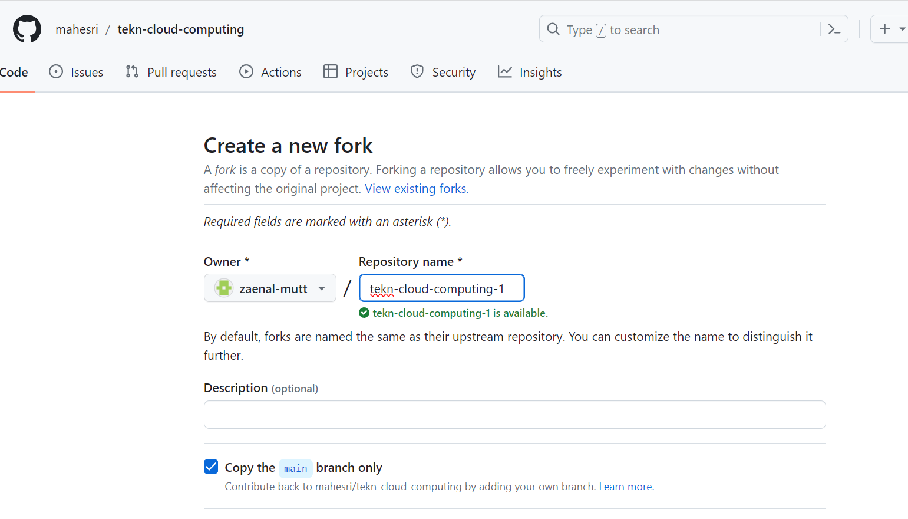
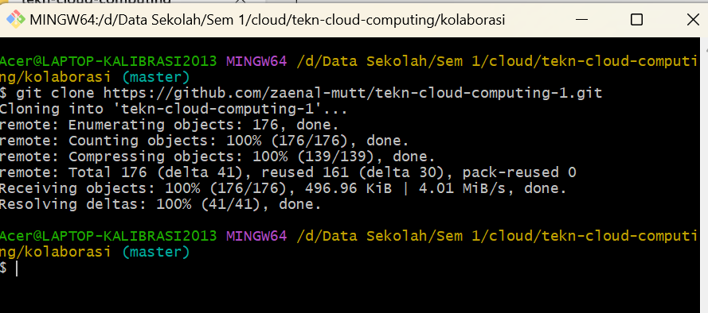
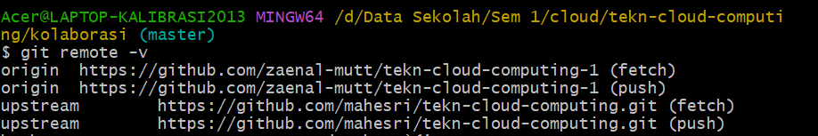

Selain untuk mengelola aset digital milik diri sendiri, kita bisa menggunakan Git untuk berkolaborasi dalam suatu repo di GitHub yang bisa diakses bersama. Dalam kasus seperti ini, berarti ada 2 peran:

Pemilik repo, sering disebut sebagai upstream author.
Kontributor, yaitu orang-orang yang akan berkontribusi memberikan konten.
Untuk situasi seperti ini, diasumsikan:

Upstream author telah membuat repo git di GitHub
Kontributor telah mengetahui adanya repo tersebut, tertarik untuk berkontribusi, sudah mengetahui apa yang akan diberikan ke proyek (repo GitHub upstream author) tersebut.
Pembahasan selanjutnya adalah tentang bagaimana kontributor bisa mengirimkan kontribusi ke repo GitHub milik upstream author.

Fork
Fork adalah membuat clone dari suatu repo di GitHub milik upstream author, diletakkan ke milik kontributor. Fork hanya dilakukan sekali saja. Pada dasarnya, proses untuk fork ini meliputi:

Fork repo di web GitHub.
Clone fork tersebut di komputer lokal.
Kontributor harus mem-fork repo upstream author sehingga di repo kontributor muncul repo tersebut.

Pilih akan ditempatkan di account mana.
Setelah proses, repo dari upstream author sudah berada di account GitHub kita (kontributor)
Setelah proses tersebut, clone di komputer lokal:

Untuk keperluan berkontribusi, ada 2 nama repo yang harus diatur:

1. origin: menunjuk ke repo milik kontributor di GitHub, hasil dari fork.
2. upstream: menunjuk ke repo milik upstream author (repo asli)
Repo origin sudah dituliskan konfigurasinya pada saat melakukan proses clone dari repo kontributor. Konfigurasi repo upstream harus dibuat.
Hasil:

Setiap kali melakukan perubahan, kirim perubahan tersebut. Pengiriman ini disebut dengan Pull Request. Pada posisi ini, kontributor bisa mengirimkan kontribusi dengan cara mengirimkan pull request (PR) ke upstream author. Secara umum, langkah-langkahnya adalah sebagai berikut:

1. Kontributor akan bekerja di repo lokal (create, update, delete isi)
2. Commit
3. Push ke repo kontributor
4. Kirimkan PR ke repo upstream author.
5. Upstream author me-review dan kemudian menyetujui (merge) ke master atau menolak PR.
6. Jika disetujui dan di-merge ke repo master dari upstream author, sinkronkan repo di komputer lokal dan repo GitHub kontributor.
