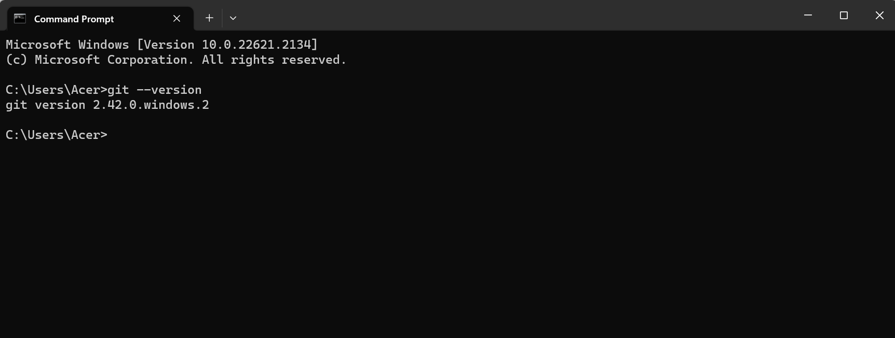
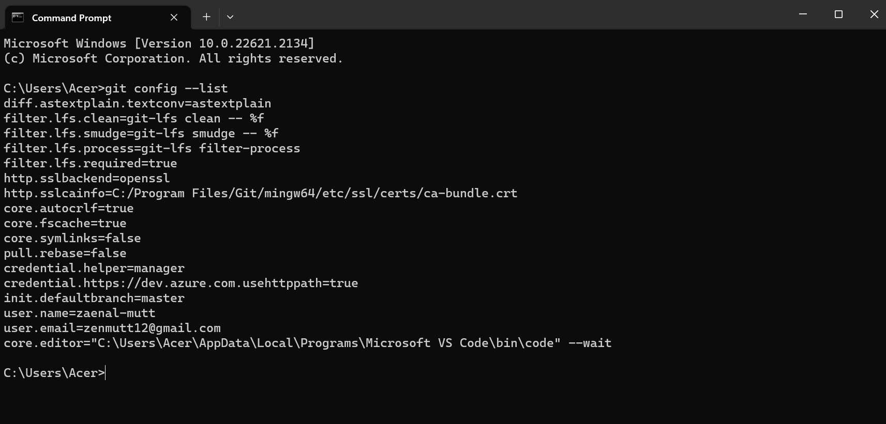
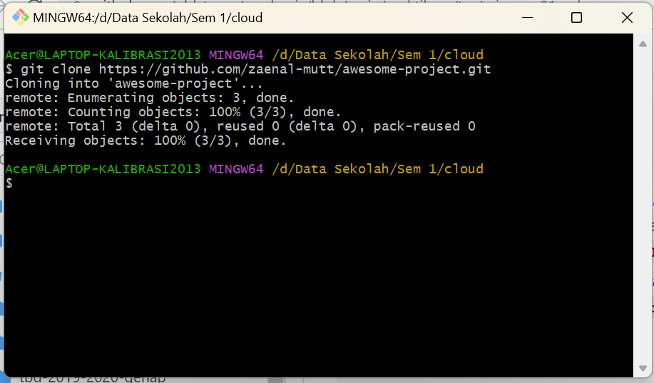
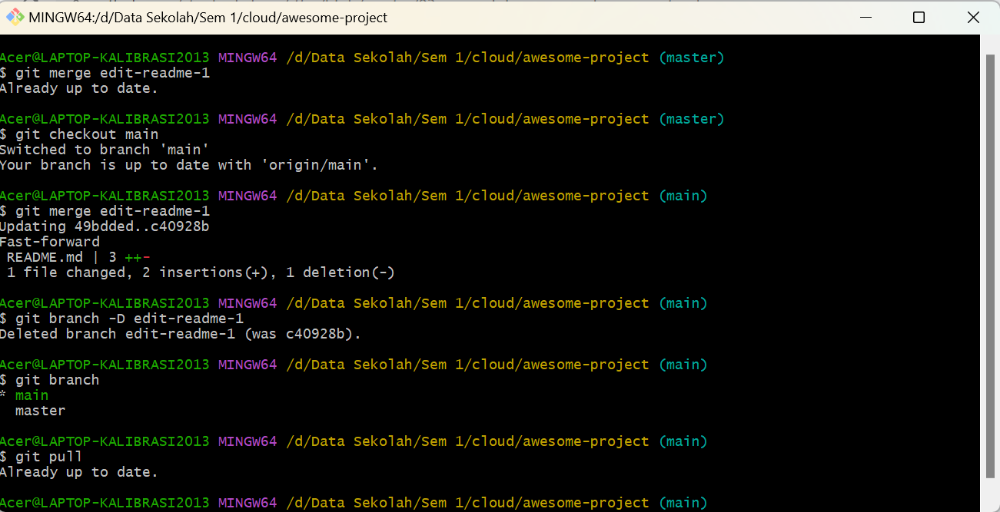
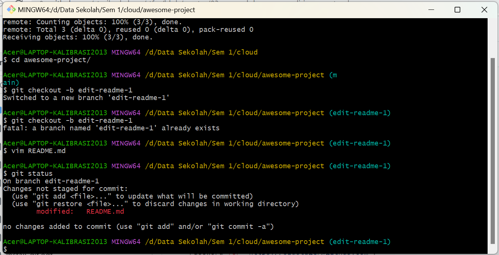
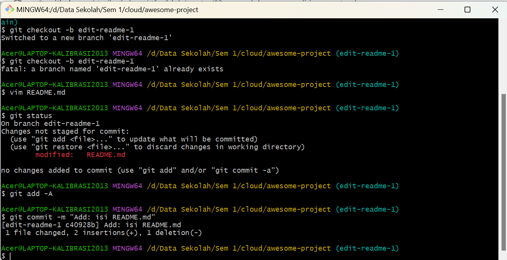
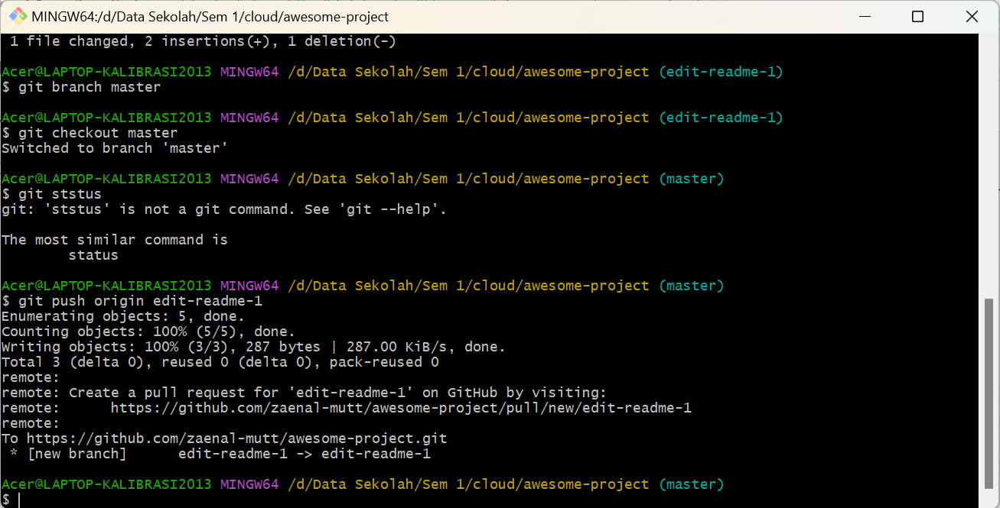
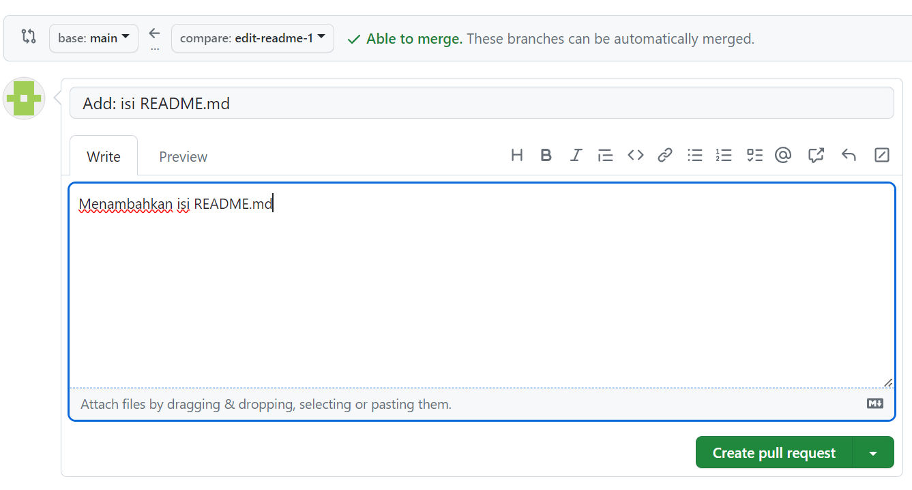
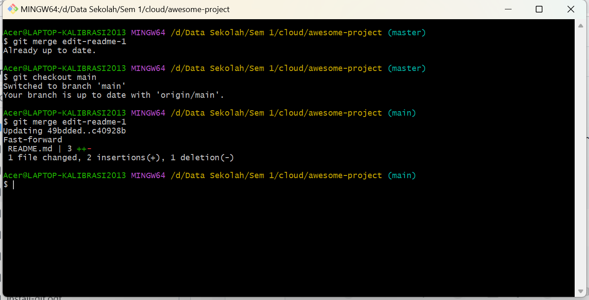

#Praktikum teknologi cloud minggu-01
1. Menginstal Git
Pada minggu pertama praktikum dimulai dengan mendownload dan menginstal aplikasi git pada device. selain itu mahasiswa juga diharuskan memiliki akun git hub. 
untuk dapat menginstal git maka kita harus mendownload git terlebih dahulu kemudian melakukan proses install seperti aplikasi-aplikasi yang lain. untuk memeriksa apakah instalasi git sudah berhasil kita dapat membuka git bash pada device kemudian memeriksa
 versi git melalui CMD dengan memasukan git --version seperti pada gambar berikut:
 
 Appabila versi git yang diinstal sudah muncul maka proses instalasi git sudah berhasil.

 2.Konfigurasi git
 konfigurasi git bertujuan untuk mengkonfigurasi git pada device dengan akun git hub yang telah dibuat. konfigurasi ini cukup dilakukan sekali saja dengan memasukan user name dan email sesuai akun git hub. setelah melakukan konfigurasi maka kita dapat memeriksanya seperti berikut:
 

 3. Mengelola-repo
 langkah pertama adalah membuat repo pada akun git hub. selanjutnya kita mengclone repo pada git hub ke dalam repo lokal/ komuter seperti berikut :
 
 setelah repo tersalin ke komputer, maka kita dapat melakukan perubahan-perubahan direpo lokal atau komputer. agar lebih aman dalam melakukan perubahan2 maka kita dapat malukan langkah-langkah sebagai berikut:
 1)Buat branch untuk menampung perubahan-perubahan

 2)Lakukan perubahan-perubahan
 
 3)Add dan commit perubahan-perubahan tersebut ke branch
 
 4)Kembali ke repo master
 
 5)Buat pull request di GitHub
 
 6)Merge pull request di GitHub
  7)Merge branch untuk menampung perubahan-perubahan tersebut ke master.
  
  8)Selesai.
  

